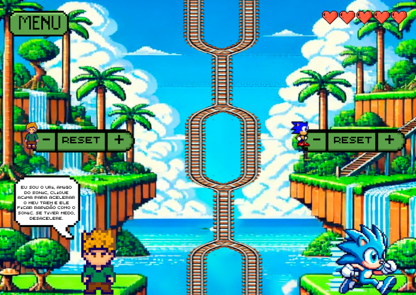
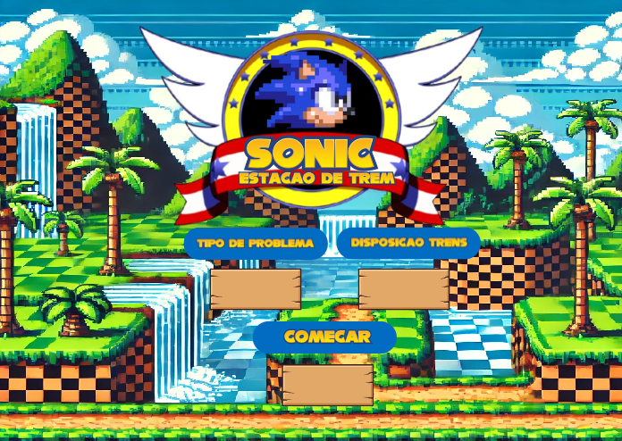

# 🚂 Java-Trem — Estação de Trem do Sonic
 
Simulação visual em **JavaFX**, com tema do Sonic, dos principais algoritmos de
**exclusão mútua** (solução do problema da região crítica) estudados em
Programação Concorrente. Dois trens (azul e amarelo) se movem por trilhos que
se cruzam em pontos compartilhados — e a forma como eles disputam a passagem
por esses pontos muda de acordo com o algoritmo de sincronização escolhido.
 

 
## 📖 Sobre o projeto
 
O projeto nasceu como trabalho da disciplina de **Programação Concorrente** e
usa uma metáfora simples e visual para representar um problema clássico de
Sistemas Operacionais/Concorrência: **como garantir que dois processos (aqui,
os trens) não acessem ao mesmo tempo uma região crítica (aqui, um trecho
compartilhado do trilho)?**
 
Cada trem roda em sua própria `Thread`, e o usuário pode escolher, pelo menu,
qual algoritmo de exclusão mútua vai controlar o acesso às regiões críticas
do trajeto.
 
## ✨ Funcionalidades
 
- 🚉 Menu inicial para configurar a simulação antes de começar
- 🔀 4 modos de disposição dos trens nos trilhos
- 🔒 3 algoritmos clássicos de exclusão mútua, selecionáveis no menu:
  - **Variável de Travamento** (*lock variable*)
  - **Estrita Alternância** (*strict alternation*)
  - **Solução de Peterson** (*Peterson's algorithm*)
- ⏩⏪ Controle individual de velocidade de cada trem (acelerar/desacelerar)
- 🔁 Botão de reset para reiniciar a simulação
## 🖼️ Telas
 
| Menu principal | Simulação em execução |
|---|---|
|  |  |
 
## 🧠 Conceitos abordados
 
O projeto é, na prática, um laboratório visual para o **problema da região
crítica**: cada trecho de trilho onde os trens poderiam colidir é tratado
como uma seção crítica, e as classes `TremAmarelo` e `TremAzul` implementam
os métodos `entrarRegiaoCritica` / `sairRegiaoCritica` para cada uma das
três soluções clássicas, permitindo comparar na prática como cada algoritmo
resolve (ou não) o problema.
 
## 🛠️ Tecnologias utilizadas
 
- **Java**
- **JavaFX** (interface gráfica, `FXML` para as telas)
- **Threads** (`java.lang.Thread`) para o movimento independente de cada trem
## 📁 Estrutura do projeto
 
```
Java-Trem/
├── Principal.java              # Classe principal (ponto de entrada da aplicação)
├── controller/
│   ├── MenuController.java     # Controla a tela de menu e as escolhas do usuário
│   └── TelaController.java     # Controla a tela principal da simulação
├── models/
│   ├── TremAmarelo.java        # Lógica de movimento e sincronização do trem amarelo
│   └── TremAzul.java           # Lógica de movimento e sincronização do trem azul
└── views/
    ├── menuPrincipal.fxml      # Layout da tela de menu
    ├── telaPrincipal.fxml      # Layout da tela de simulação
    └── image/                  # Assets visuais (trens, cenário, menu)
```
 
## ▶️ Como executar
 
Pré-requisitos:
- [JDK 17+](https://adoptium.net/)
- [JavaFX SDK](https://gluonhq.com/products/javafx/) compatível com a sua versão do JDK
Pelo terminal (ajuste `<caminho-javafx-sdk>` para o local onde extraiu o JavaFX):
 
```bash
# Compilar
javac --module-path <caminho-javafx-sdk>/lib --add-modules javafx.controls,javafx.fxml -d bin $(find . -name "*.java")
 
# Copiar os recursos (fxml e imagens) para a pasta de saída
cp -r views bin/
 
# Executar
java --module-path <caminho-javafx-sdk>/lib --add-modules javafx.controls,javafx.fxml -cp bin Principal
```
 
> 💡 Alternativamente, o projeto pode ser aberto em uma IDE com suporte a
> JavaFX (Eclipse, IntelliJ IDEA ou VS Code com a extensão *Extension Pack
> for Java*), configurando o JavaFX SDK nas bibliotecas do projeto.
 
## 👩‍💻 Autora
 
**Carolina de Moraes Carneiro**
Projeto desenvolvido para a disciplina de Programação Concorrente.

## 📁 Estrutura do projeto
